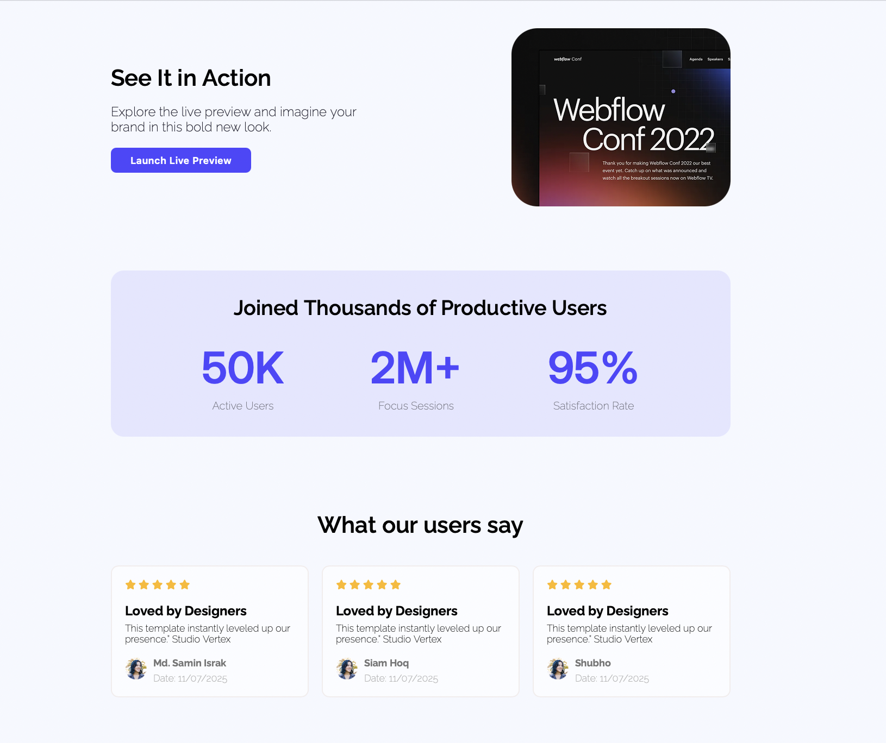

# Modern Landing Page – Assignment 1

A sleek, modern **Landing Page** designed with clean UI and smooth interactions. Built as part of **PH-B12 Assignment 1**, this project demonstrates fundamental web development skills using **HTML5** and **CSS3**.

---

## 🔥 Live Demo

👉 [View the Live Project](https://samin1362.github.io/PH-B12-Assignment-1/)  
*Deployed with GitHub Pages*

---

## ✨ Features

-  **Modern UI** – Clean layout with bold typography and intuitive structure
-  **Image Showcase** – Product screenshots and feedback sections
-  **Contact Form** – Input fields for user communication
-  **User Testimonials** – Styled card-based user feedback
-  **Smooth Hover Effects** – Enhanced user experience with transitions
-  **Font Awesome Icons** – Eye-catching star and UI elements

---

## 🛠 Technologies Used

| Tech | Description |
|------|-------------|
| **HTML5** | Semantic markup and layout structure |
| **CSS3** | Flexbox, media queries, custom buttons, and hover animations |
| **Google Fonts** | Integrated Raleway & Inter font families |
| **Font Awesome** | For icons and visual appeal |
| **VS Code + Live Server** | Local development and testing |

